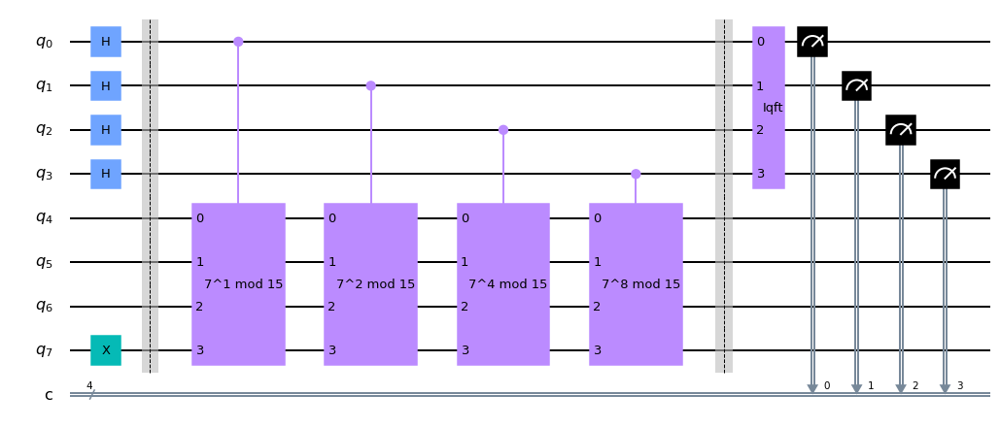

# Replicating Shor's Algorithm on Qiskit

In this implementation, we'll be using 2 registers. The first register will contain the actual measurement qubits. The second register will just be an eigenstate of the unitaries being applied on it. Think of this second register as generous folk that dish out relative phases to the ancilla/control qubit. Here's the general outline of the algorithm:

1. First, we begin by initializing our qubits. On the first register, we apply a hadamard transform to put it over a superposition of all computational basis states. Looking at the second register, we put those target qubits in an eigenstate of our unitary operation. 

2. Second, we map the modular exponentiation operations to the measurement qubits. This is done by applying a unitary operator with various powers onto the target qubits while controlling it with each of the different measurement qubits. Applying the operator with various powers ensures that the eigenvalues that get kicked back transform the measurement qubits into a fourier basis. The unitary operator in this case implements modular exponentiation. Refer to the circuit diagram above.

3. Third, we expose the period by applying an inverse quantum Fourier transform on the measurement qubits. This works since the quantum phase estimation subroutine encoded the modular exponentiation functions with a fourier basis on the measurement qubits. Applying an inverse QFT just translates that fourier basis into the computational basis thereby revealing periodic elements.

4. Finally, we measure the first register.

After the measurement outcomes are determined, we will need to do additional classical post-processing in order to determine the factors or to decide to run the program again.
## Circuit Schematic for our implementation

